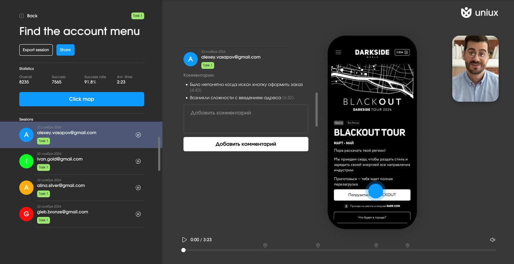

This is a [Next.js](https://nextjs.org) project bootstrapped with [`create-next-app`](https://nextjs.org/docs/app/api-reference/cli/create-next-app).

## UNIUX APP

Uniux is a service for testing concepts and UX/UI hypotheses using Figma layouts right in the user's phone. Test hypotheses accurately and lightning
fast.

